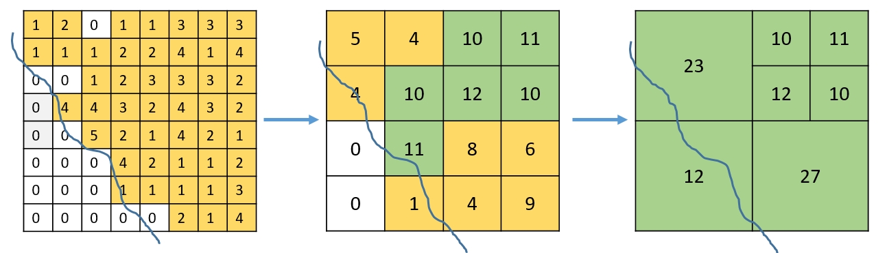
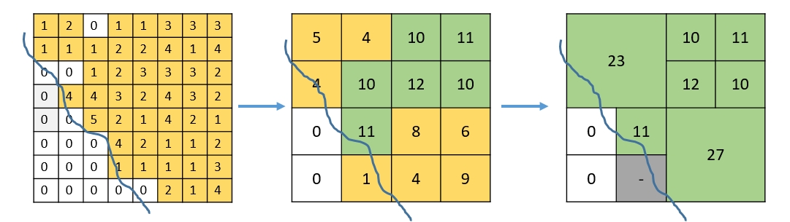

```{r setup, include = FALSE}
knitr::opts_chunk$set(
  collapse = TRUE,
  comment = "#>"
)
```

<!-- output: rmarkdown::html_vignette  -->
<!-- setwd("D:/git/jskoien/MRG"); devtools::build_rmd("vignettes/MRG_example.rmd") -->
<!-- devtools::install(build_vignettes = TRUE) -->
<!--  devtools::build_vignettes() # before building source package for export -->

# Introduction


The MRG package has been created to generate gridded output of data from censuses and surveys,
respecting different requirements, such as confidentiality rules for protecting the privacy of individuals.
The package has been particularly developed for handling Farm Structure Survey data, but
can be used for many other purposes.

The package provides two main methods for gridding of data:

- multiResGrid: a function that merges grid cells until the confidentiality rules are 
            respected. In areas with high density of respondents, the density is higher
            whereas it is lower in areas with low density of respondents.
- remSmall: a function that moves information to neighbouring cells, until
            the confidentiality rules are respected.  

In addition, there is support functionality for the main methods above.

The package is highly flexible, in the sense that it includes three different methods for 
confidentiality and reliability, where parameters can be varied. Additionally, it is possible 
to add a user defined function
for applications where other restrictions are necessary.

Together with the gridding approach, there is also a possibility to apply a  
contextual suppression of grid cells. This means that grid cells will not be aggregated with 
neighbours if their value is small compared with the non-confidential neighbours, they
will instead be suppressed in a post-processing step at the end.


# The Farm Structure Survey data
The Farm Structure Survey data comes from a European wide survey of agricultural holdings,
conducted by the national statistical bureaus.
A range of variables have been collected from each of the holdings in the survey, 
including agricultural area, organic agricultural area, number of employees, gender and age of
owners, number of animals and their type, etc. A census (attempt to sample data from all holdings) 
usually takes place every 10 years
(2000, 2010, 2020, ...), whereas surveys (samples from about 20% of the holdings) take place
every 3-4 years between the census years. Some holdings, particularly in survey years,
are representative for 
a larger group, and are attributed a weight to be applied if data are aggregated
in any way.

A large number of the agricultural variables would be of interest to stakeholders and researchers.
However, there are confidentiality rules in place, which limits the 
possibilities for sharing the data, they can only be distributed as aggregated variables. 
To distribute the aggregated values (mean or sum) for a grid cell or administrative unit, the data
must respect the following two confidentiality rules:
- Frequency rule: Data for a grid cell can not be distributed if it is based on less than 
                 10 (weighted) holdings
- Dominance rule: If the two largest holdings (or the largest holding if it has
                 a weight of two) represent more than 85% of the value in a grid cell,
                 the data of the grid cell can not be distributed. 
                 
Additionally, it also includes a reliability rule for sample data with weights. 
This is to assure that the expected uncertainty of the result is below a threshold.
The default is that the expected coefficient of variation (CV) should be below 0.35.

The original data set is restricted. However, the package includes a "fake"
data set, which has the same structure as a real data set, but manipulated to be the same 
as any real farms. This makes it possible to test the methodology also for those
who don't have access to the original data. 

        
# Methods
## multiResGrid
This function attempts to keep the resolution as high as possible, while respecting the 
confidentiality rules. Starting with a high resolution grid (for example 1*1 km), it will first
check groups of four grid cells which are within the lower resolution grid cells. 
If the confidentiality rule fails for any of the high resolution cells, the function will
only keep the aggregated value from the lower resolution grid. 

The figure below gives an indication of how the function works. In this simplified example, 
the numbers reflect the number of holdings in each grid cell, and we are only considering
the frequency rule, i.e., that the number of holdings in a grid cell has to be at least 10.
In the first grid in the figure below, non of the grid cells have more than 10 holdings,
they are all yellow (except for the white ones without holdings at all). 
In the second grid, the four grid cells in the upperright corner have reached the limit and are green, 
in addition to two 
grid cells in the central left side.  
However, there are still grid cells with less than 10 holdings in the lower left corner, 
so also these are merged in the transition to the grid at the right in the figure. 
The four grid cells in the top right corner are kept though.


{width=300px}


However, we could imagine cases where we would rather like to suppress the grid cell with 1
holding in the central image, to be able to keep the higher resolution grid cell with 11 holdings.
The gridding function therefore includes a parameter (suppresslim) that sets a minimum limit for the values
inside a confidential grid cell to be merged with neigbouring grid cells. This limit could
for example be 0.1, in that case the grid cell with one holding should be suppressed as in the figure below.

{width=300px}


The package includes a synthetic test data set, which includes data of
a similar type and distribution as the true FSS data. This is used in the examples of the methodology below.

# Examples
## Reading data and producing basic grids

``` {r}
library(sf)
library(dplyr)
library(viridis)
library(ggplot2)
library(giscoR)
library(ggforce)
library(patchwork)
library(kableExtra)
library(MRG)
```
``` {r, cache = TRUE}

data(ifs_dk) # Census data (weights in EXT_CORE, all equal to 1)
ifs_weight = ifs_dk[ifs_dk$Sample == 1, ] # The sample data, weights in EXT_MODULE, varying
# The sum of the weights (EXT_MODULE) are equal to the population size
sum(ifs_weight$EXT_MODULE) - dim(ifs_dk)[1] 

# Create spatial data
# Move coordinates away from grid cell boundaries with locAdj = "LL",
# as holdings are registered with coordinates in the lower left corner
# of the INSPIRE 1*1 km grid.
# Coordinates exactly on the border can cause issues in some functions
# This function is particular for the FSS data set, with a particular format
# for the geo-location. For other data sets, the coordinate shift can be done
# on an sf-object either with the function locAdjFun, or in a call to 
# createMRGobject.
ifg = fssgeo(ifs_dk, locAdj = "LL")
ffg = fssgeo(ifs_weight, locAdj = "LL")

# Read country borders for Denmark, only used for plotting
borders = gisco_get_nuts(nuts_level = 0)
dkb = borders[borders$CNTR_CODE == "DK",] %>% st_transform(crs = 3035)
# Necessary to avoid some warnings for intersection further down
st_agr(dkb) = "constant"

# Set the base resolutions, and create a hierarchical list with gridded data
# No variable name is needed if we're only looking at the number of holdings
# but we include the utilized agricultural area, as it will also be used further below.
ress = c(1,5,10,20,40, 80, 160)*1000

ifl = list()
ifl = gridData(ifg, vars = "UAA",  res = ress)

# List of grids for the organic utilized agricultural area
ifl2 = gridData(ifg, vars = "UAAXK0000_ORG", res = ress)

# List of grids with two variable (weights could be ignored, as they are all equal to one)
ifl3 = gridData(ifg, vars = c("UAA", "UAAXK0000_ORG"), weights = "EXT_CORE", res = ress)

# List of grids for for the sample data (weights necessary)
ffl = gridData(ffg,  vars = c("UAA"), weights = "EXT_MODULE",  res = ress)


``` 

Just to understand the distribution of grid cells which should be confidential or not, 
We can create a table, giving an overview of grid cells with the number of holdings greater or equal to 10,
and grid cells with less than 10 holdings. Below the different grids are plotted together.

``` {r, cache = TRUE}
ifltab = data.frame("N GE 10" = unlist(lapply(ifl, FUN = function(x) sum(x$count >= 10))),
                    "N LT 10" = unlist(lapply(ifl, FUN = function(x) sum(x$count < 10))))
ifltab


# Create a single data.frame for the hierarchical grids for plotting
ifall = do.call("rbind", ifl[1:6])
ifall$res1 = paste(ifall$res/1000, "km")
ifall$res2 = factor(ifall$res1, levels = unique(ifall$res1))

# Plot the hierarchical grids of Denmark
ggplot() + geom_sf(data = ifall, aes(fill = count), lwd = 0) +
  scale_fill_viridis( name = "number of \n holdings", trans = "log10") +
  scale_color_viridis( name = "number of \n holdings", trans = "log10") +
  geom_sf(data = dkb, fill = NA, colour='black', lwd = 1) +
  #  coord_sf(crs = 3035) +
  theme_bw() +
  theme(panel.grid.major = element_line(colour = 'transparent')) +
  ggtitle("Number of holdings for different resolutions") +
  facet_wrap(vars(res2))
``` 


## Only number of holdings
First we create a multi-resolution grid function only with farm number as confidentiality rule
(The dominance rule does not apply if we only analyse the number of holdings)


``` {r, cashe = TRUE}
himg0 = multiResGrid(ifl, checkValidity = FALSE)

# Some points that will help visualizing some differences between plots
pta = data.frame(matrix(ncol = 2, byrow = TRUE, 
                        data = c(4245000, 3685000,
                                 4345000, 3815000)))
pta$rad = c(20000)
pta$color = c("red")

xlim = c(4200000, 4400000)
ylim = c(3650000, 3840000)

# Clip the result to the coastline of Denmark and create ggplot
himg00 = st_intersection(dkb, himg0)

g0 = ggplot() + geom_sf(data = himg00, aes(fill = count), lwd = 0) +
  scale_fill_viridis( name = "number of farms", trans = "log10") +
  geom_sf(data = dkb, fill = NA, colour='black', lwd = 1) +
  scale_color_identity(guide = "none") +
  geom_circle(data = as.data.frame(pta), aes(x0 = X1, y0 = X2, r = rad, color = color)) +
  xlab("") + ylab("") +
  ggtitle("Only frequency rule") +
  coord_sf(xlim = xlim, ylim = ylim) +
  theme(text = element_text(size = 10)) +
  theme_bw()


# Create multi-resolution grid for utilized agricultural area (UAA), 
# clip it to the coastline and create ggplot for the number of farms
himg1 = multiResGrid(ifl, vars = "UAA", ifg = ifg)
himg01 = st_intersection(dkb, himg1)
g1 = ggplot() + geom_sf(data = himg01, aes(fill = count), lwd = 0) +
  scale_fill_viridis( name = "number of farms", trans = "log10") +
#  scale_color_viridis( name = "number of farms", trans = "log10") +
  geom_sf(data = dkb, fill = NA, colour='black', lwd = 1) +
  scale_color_identity(guide = "none") +
  geom_circle(data = as.data.frame(pta), aes(x0 = X1, y0 = X2, r = rad, color = color)) +
  coord_sf(xlim = xlim, ylim = ylim) +
  xlab("") + ylab("") +
  ggtitle("Frequency and dominance rule") +
  theme(text = element_text(size = 15)) +
  theme_bw()

print(g0+g1 + plot_layout(guides = "collect"))
```


In a second step, we can run the same procedure, but for the utilized agricultural area (UAA).
Then the function will also check that the dominance rule is respected for all pixels. 
Two plots are necessary to show the results of this procedure. The first one shows the 
number of farms,
as above, but also respecting the dominance rule. The second plot shows the gridded UAA
from the same holdings. It should be noted that there is only a small effect from
applying the dominance rule in this example.


``` {r, cashe = TRUE}


pta = data.frame(matrix(ncol = 2, byrow = TRUE, 
                        data = c(4245000, 3685000,
                                 4345000, 3815000)))
pta$rad = c(20000)
pta$color = c("red")

xlim = c(4200000, 4400000)
ylim = c(3650000, 3840000)
# Clip the result to the coastline of Denmark and create ggplot
himg00 = st_intersection(dkb, himg0)
g0 = ggplot() + geom_sf(data = himg00, aes(fill = count), lwd = 0) +
  scale_fill_viridis( name = "number of farms", trans = "log10") +
#  scale_color_viridis( name = "number of farms", trans = "log10") +
  geom_sf(data = dkb, fill = NA, colour='black', lwd = 1) +
  #  coord_sf(crs = 3035) +
  scale_color_identity(guide = "none") +
  geom_circle(data = as.data.frame(pta), aes(x0 = X1, y0 = X2, r = rad, color = color)) +
  xlab("") + ylab("") +
  ggtitle("Only frequency rule") +
  coord_sf(xlim = xlim, ylim = ylim) +
  theme(text = element_text(size = 10)) +
  theme_bw()


# Create multi-resolution grid for utilized agricultural area (UAA), 
# clip it to the coastline and create ggplot for the number of farms
himg1 = multiResGrid(ifl, vars = "UAA", ifg = ifg)
himg01 = st_intersection(dkb, himg1)
g1 = ggplot() + geom_sf(data = himg01, aes(fill = count), lwd = 0) +
  scale_fill_viridis( name = "number of farms", trans = "log10") +
#  scale_color_viridis( name = "number of farms", trans = "log10") +
  geom_sf(data = dkb, fill = NA, colour='black', lwd = 1) +
  scale_color_identity(guide = "none") +
  geom_circle(data = as.data.frame(pta), aes(x0 = X1, y0 = X2, r = rad, color = color)) +
  coord_sf(xlim = xlim, ylim = ylim) +
  xlab("") + ylab("") +
  ggtitle("Frequency and dominance rule") +
  theme(text = element_text(size = 15)) +
  theme_bw()

print(g0+g1 + plot_layout(guides = "collect"))


# Create ggplot for UAA - using the same input file (himg01) as for g1 above
g11 = ggplot() + geom_sf(data = himg01, aes(fill = UAA, color = UAA)) +
  scale_fill_viridis( name = "UAA (ha)", trans = "log10") +
  scale_color_viridis( name = "UAA (ha)", trans = "log10") +
  geom_sf(data = dkb, fill = NA, colour='black', lwd = 1) +
  xlab("") + ylab("") +
  ggtitle("") +
  theme_bw()

g11 

# Create multi-resolution grid for the organic UAA (UAAXK0000_ORG), 
# clip to the coastline and create ggplot of the organic UAA per grid cell 
himg2 = multiResGrid(ifl2, vars = "UAAXK0000_ORG", ifg = ifg)
himg02 = st_intersection(dkb, himg2)
g12 = ggplot() + geom_sf(data = himg02, aes(fill = UAAXK0000_ORG, color = UAAXK0000_ORG)) +
  scale_fill_viridis( name = "UAA Organic (ha)", trans = "log10") +
  scale_color_viridis( name = "UAA Organic (ha)", trans = "log10") +
  geom_sf(data = dkb, fill = NA, colour='black', lwd = 1) +
  ggtitle("") +
  theme_bw()

g12 

# Create multi-resolution grids with increasing values for suppresslim 
# Postprocess in second step
himg11 = multiResGrid(ifl, vars = "UAA", ifg = ifg, postProcess = FALSE, suppresslim = 0)
himg111 = MRGpostProcess(himg11, vars = "UAA")
himg12 = multiResGrid(ifl, vars = "UAA", ifg = ifg, postProcess = FALSE, suppresslim = 0.02)
himg121 = MRGpostProcess(himg12, vars = "UAA")
himg13 = multiResGrid(ifl, vars = "UAA", ifg = ifg, postProcess = FALSE, suppresslim = 0.05)
himg131 = MRGpostProcess(himg13, vars = "UAA")
himg14 = multiResGrid(ifl, vars = "UAA", ifg = ifg, postProcess = FALSE, suppresslim = 0.1)
himg141 = MRGpostProcess(himg14, vars = "UAA")
himg15 = multiResGrid(ifl, vars = "UAA", ifg = ifg, postProcess = FALSE, suppresslim = 0.2)
himg151 = MRGpostProcess(himg15, vars = "UAA")
# Clip to coastline
himg1111 = st_intersection(dkb, himg111)
himg1211 = st_intersection(dkb, himg121)
himg1311 = st_intersection(dkb, himg131)
himg1411 = st_intersection(dkb, himg141)
himg1511 = st_intersection(dkb, himg151)

# Locations for circles
pta = data.frame(matrix(ncol = 2, byrow = TRUE, 
                        data = c(4220000, 3640000,
                                 4320000, 3820000,
                                 4363000, 3695000,
                                 4390000, 3540000)))
pta$rad = c(50000, 30000, 30000, 50000)
pta$color = c("red", "black", "blue", "green")
slims = c(0, 0.02, 0.05, 0.1, 0.2)
himgs = list(himg111, himg121, himg131, himg141, himg151)
ps = list()
ahuas = c(himg111$UAA, himg121$UAA, himg131$UAA, himg141$UAA, himg151$UAA)
lims = range(ahuas[ahuas > 0], na.rm = TRUE)
for (ii in 1:length(himgs)) {
  hint = himgs[[ii]]
  st_agr(hint) = "constant"
  hint = st_intersection(dkb, hint)
  ps[[ii]] = ggplot() + geom_sf(data = hint, aes(fill = UAA), lwd = 0) +
    scale_fill_viridis( name = "UAA (ha)", trans = "log10", limits = lims, na.value="red") +
    geom_sf(data = dkb, fill = NA, colour='black', lwd = 0.5) +
    ggtitle(paste("Suppresslim = ", slims[[ii]])) +
    scale_color_identity(guide = "none") +
    geom_circle(data = as.data.frame(pta), aes(x0 = X1, y0 = X2, r = rad, color = color)) +
    xlab("") + ylab("") +
    theme_bw()
}

# Only printing the first four plots
ps[[1]]  + ps[[2]] + ps[[3]]  + ps[[4]] + plot_layout(guides = "collect")

# create lists of the non post-processed and the post-processed results
hnPro = list(himg11, himg12, himg13, himg14, himg15)
hpro = list(himg111, himg121, himg131, himg141, himg151)
# Get the number of grid cells for each of them
d1 = unlist(lapply(hnPro, FUN = function(x) dim(x)[1]))
d2 = unlist(lapply(hpro, FUN = function(x) sum(is.na(x$UAA))))

# Create tables of resolutions for each suppressvalue separately for the two sets of results
r1s = lapply(hnPro, FUN = function(x) as.data.frame(table(x$res)))
r2s = lapply(hpro, FUN = function(x) as.data.frame(table(x$res[!is.na(x$count)])))

# Join the tables above to one table for each set of results
r11s = r1s[[1]]
r22s = r2s[[1]]
for (ii in 2:length(r1s)) {
  r11s = r11s %>% left_join(r1s[[ii]], by = "Var1")
  r22s = r22s %>% left_join(r2s[[ii]], by = "Var1")
}
r11s[is.na(r11s)] = 0
r22s[is.na(r22s)] = 0
slim = c(0, 0.02, 0.05, 0.1, 0.2)
slims = paste0("sl_", slim)
names(r11s) = names(r22s) = c("res", slims)
r11s$res = as.numeric(as.character(r11s$res))/1000
r22s$res = as.numeric(as.character(r22s$res))/1000

# difference between them
rdiff = data.frame(r11s$res, r11s[, 2:dim(r11s)[2]]-r22s[, 2:dim(r11s)[2]])

# Creating latex table output
rnew = r11s
for (icol in 2:6) {
  irows = dim(r11s)[1]
  spaces = ifelse(rdiff[,icol] >= 10, rep(" ",irows ), rep("\\hskip 10pt   ", irows))
  rnew[, icol] = paste0(r11s[,icol], spaces, "(", rdiff[, icol], ")")
}
lnew = rnew %>%
  kbl(caption="Distribution of grid cell sizes for different values of suppresslim
            with the number of suppressed grid cells in brackets",
      format="latex",
      col.names = c("Resolution (km)", slim),
      align="r",
      escape = F) %>%
  kable_minimal(full_width = F,  html_font = "Source Sans Pro")
lnew


# Create grids from the sample data, with and without checking the reliability
# of the grids
himg4 = multiResGrid(ffl, vars = c("UAA"), weights = "EXT_MODULE", ifg = ffg, 
              strat = "STRA_ID_CORE", checkReliability = FALSE)

himg5 = multiResGrid(ffl, vars = c("UAA"), weights = "EXT_MODULE", ifg = ffg, 
              strat = "STRA_ID_CORE", checkReliability = TRUE)

himg4 = himg4[himg4$weight1 > 0,]
himg04 = st_intersection(dkb, himg4)
atlims1 = range(c(himg4$weight1, himg5$weight1, himg4$count, himg5$count), na.rm = TRUE)
g1 = ggplot() + geom_sf(data = himg04, aes(fill = weight1), lwd = 0) +
  scale_fill_viridis( name = "number of farms", trans = "log10", limits = atlims1, na.value = "red") +
  scale_color_viridis( name = "number of farms", trans = "log10", limits = atlims1, na.value = "red") +
  geom_sf(data = dkb, fill = NA, colour='black', lwd = 1) +
  ggtitle("Farms without validity check") +
  theme_bw()

himg05 = st_intersection(dkb, himg5)
g2 = ggplot() + geom_sf(data = himg05, aes(fill = weight1), lwd = 0) +
  scale_fill_viridis( name = "number of farms", trans = "log10", limits = atlims1, na.value = "red") +
  scale_color_viridis( name = "number of farms", trans = "log10", limits = atlims1, na.value = "red") +
  geom_sf(data = dkb, fill = NA, colour='black', lwd = 1) +
  ggtitle("Farms with validity check") +
  theme_bw()

atlims11 = range(c(himg4$count, himg5$count))
g01 = ggplot() + geom_sf(data = himg04, aes(fill = count), lwd = 0) +
  scale_fill_viridis( name = "number of farms", trans = "log10", limits = atlims1, na.value="red") +
  scale_color_viridis( name = "number of farms", trans = "log10", limits = atlims1, na.value = "red") +
  geom_sf(data = dkb, fill = NA, colour='black', lwd = 1) +
  ggtitle("Records without validity check") +
  theme_bw()

g02 = ggplot() + geom_sf(data = himg05, aes(fill = count), lwd = 0) +
  scale_fill_viridis( name = "number of farms", trans = "log10", limits = atlims1, na.value="red") +
  scale_color_viridis( name = "number of farms", trans = "log10", limits = atlims1, na.value="red") +
  geom_sf(data = dkb, fill = NA, colour='black', lwd = 1) +
  ggtitle("Records with validity check") +
  theme_bw()


print(g01 + g1 + g02 + g2 + plot_layout(guides = "collect"))


# Create joint multi-resolution grid for UAA and organic UAA, and apply suppresslim to avoid unnecessary aggregation 
himg3 = multiResGrid(ifl3, vars = c("UAA", "UAAXK0000_ORG"), ifg = ifg, suppresslim = 0.05)
# Create the ratio, and clip to coastline
himg3$ratio = himg3$UAAXK0000_ORG/himg3$UAA
himg03 = st_intersection(dkb, himg3)
st_agr(himg03) = "constant"
lims = c(min(himg03$UAAXK0000_ORG[himg03$UAAXK0000_ORG > 0], na.rm = TRUE), max(himg03$UAA, na.rm = TRUE))
g131 = ggplot() + geom_sf(data = himg03, aes(fill = UAA), lwd = 0) +
  scale_fill_viridis( name = "UAA (ha)", trans = "log10", limits = lims) +
  scale_color_viridis( name = "UAA (ha)", trans = "log10", limits = lims) +
  geom_sf(data = dkb, fill = NA, colour='black', lwd = 1) +
  ggtitle("UAA") +
  theme_bw()
g132 = ggplot() + geom_sf(data = himg03[himg03$UAAXK0000_ORG > 0,], aes(fill = UAAXK0000_ORG), lwd = 0) +
  scale_fill_viridis( name = "UAA (ha)", trans = "log10", limits = lims) +
#  scale_color_viridis( name = "UAA (ha)", trans = "log10", limits = lims) +
  geom_sf(data = dkb, fill = NA, colour='black', lwd = 1) +
  ggtitle("UAA organic") +
  theme_bw()
g133 = ggplot() + geom_sf(data = himg03, aes(fill = ratio), lwd = 0) +
  scale_fill_viridis( name = "Organic share") +
  scale_color_viridis( name = "Organic share") +
  geom_sf(data = dkb, fill = NA, colour='black', lwd = 1) +
  ggtitle("Organic share") +
  theme_bw()

g131 + g132 + plot_layout(guides = "collect") + plot_spacer() + g133 

